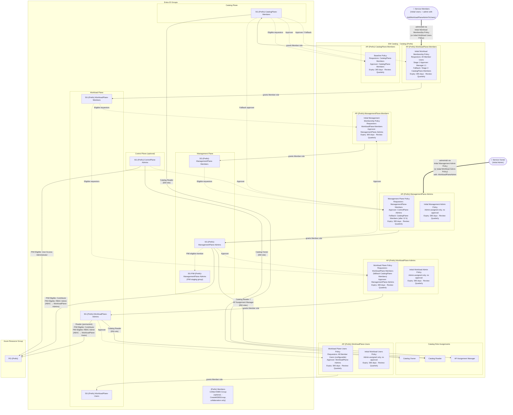
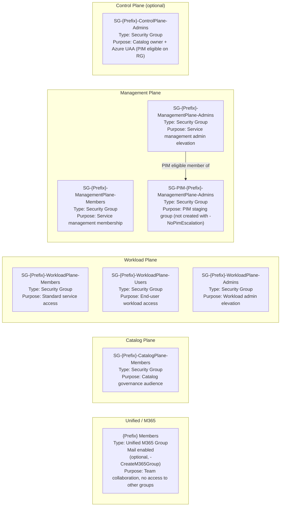
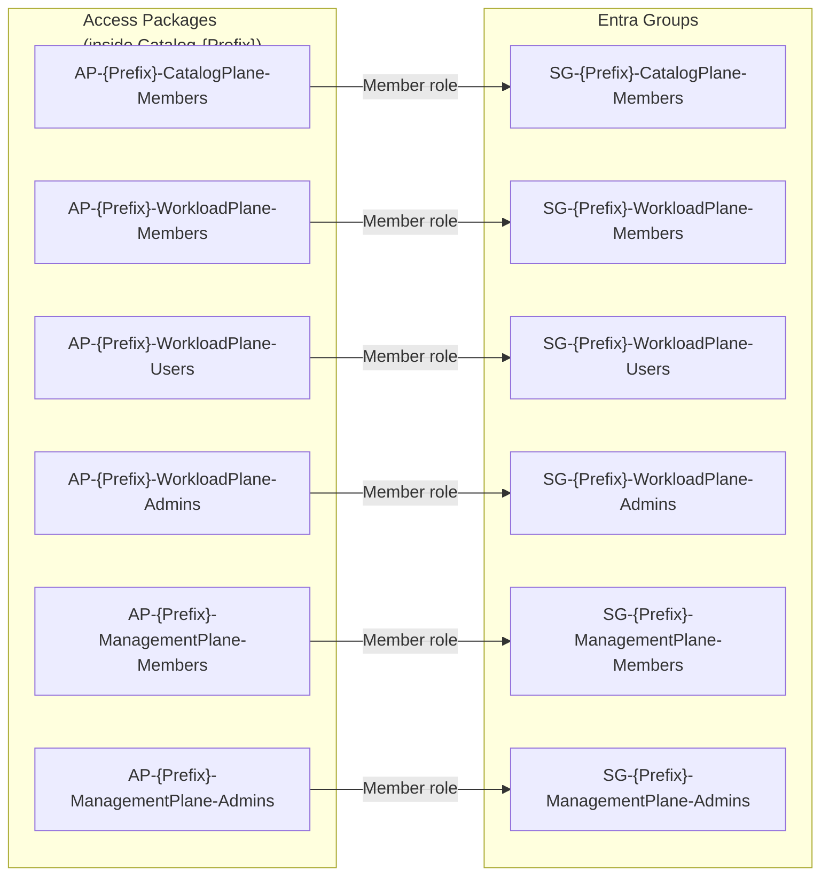
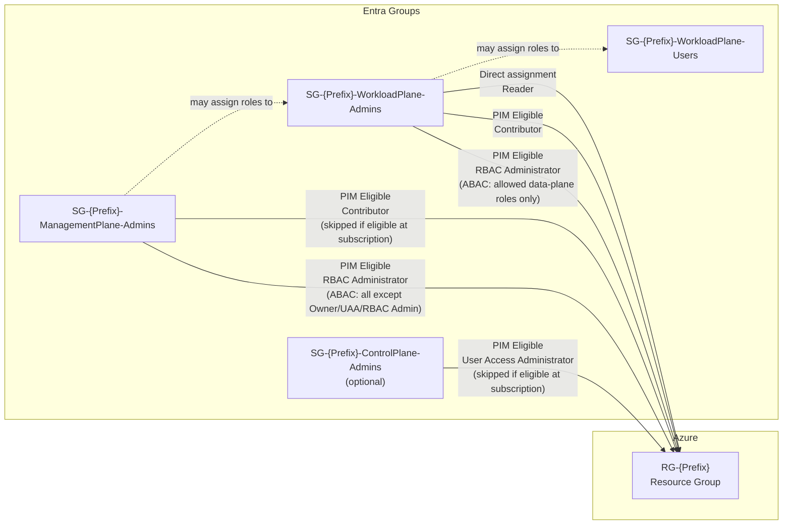
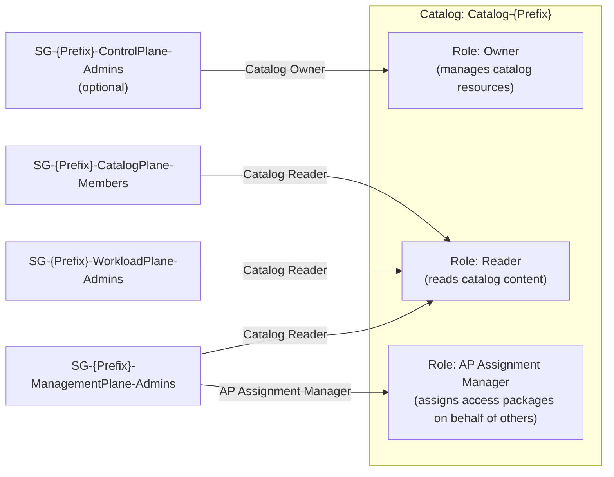
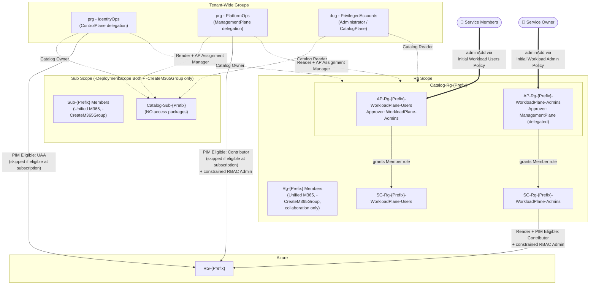

# ServiceEM Landing Zone - Resource & Dependency Visualization

> **Note**: Sections 1-6 show a single `New-EntraOpsServiceBootstrap` scope with its **default ServiceRoles** (all group types, PerService, no delegation). `New-EntraOpsSubscriptionLandingZone` creates one such scope (default `-DeploymentScope ResourceGroup` or `Subscription`) without WorkloadPlane-Members, or distributes the roles across a **Sub** and an **Rg** scope with `-DeploymentScope Both` (see [Service EM → Deployment Scopes](../service-em/index.html#deployment-scopes)). For **Centralized governance** (using tenant-wide delegation groups), see the [Centralized Model Notes](#centralized-governance-model-notes) section below.

> Replace `{Prefix}` with the service name: `-ServiceName` of `New-EntraOpsServiceBootstrap`, or `Sub-<DeploymentPrefix>` / `Rg-<DeploymentPrefix>` for landing zones (e.g., `Sub-MyApp` or `Rg-MyApp`). The resource group is named `RG-{Prefix}` without the `Sub-`/`Rg-` prefix (e.g., `RG-MyApp`); with `-DeploymentScope Subscription` no resource group is created and the Azure roles are assigned on the subscription.  
> Nodes marked *(optional)* are skipped when using `-SkipControlPlaneDelegation`.  
> Nodes marked *(delegated)* are replaced by an existing group when a delegation Group ID is configured.

## Delegation Overview

ControlPlane-Admins, ManagementPlane-Admins and CatalogPlane-Members groups can be **delegated** to existing groups instead of
creating new ones. This is useful when a central platform team already manages these groups across multiple
landing zones.

**How to configure delegation** (pick one):

| Method | ControlPlane-Admins | ManagementPlane-Admins | CatalogPlane-Members |
|---|---|---|---|
| Parameter | `-ControlPlaneDelegationGroupId <ObjectId>` | `-ManagementPlaneDelegationGroupId <ObjectId>` | `-AdministratorGroupId <ObjectId>` |
| EntraOpsConfig (landing zone cmdlet only) | `ServiceEM.ControlPlaneDelegationGroupId` | `ServiceEM.ManagementPlaneDelegationGroupId` | `ServiceEM.AdministratorGroupId` |
| Skip flag (no delegation, no creation) | `-SkipControlPlaneDelegation` | `-SkipManagementPlaneDelegation` | — |

When a delegation Group ID is set (via parameter **or** config), the skip flag is **automatically applied**:
no new group is created, and the provided group is used for all catalog role, policy approver, and Azure RBAC
assignments that would otherwise reference the landing-zone-owned group.

**What still uses the delegated group:**
- Catalog Owner role (`ControlPlaneDelegationGroupId`), a permanent assignment unless `-SkipCatalogOwnerAssignment` is set (see [Catalog Owner assignment](../service-em/index.html#catalog-owner-assignment-for-controlplane-admins))
- Catalog Reader and AP Assignment Manager catalog roles (`ManagementPlaneDelegationGroupId`), Catalog Reader (`AdministratorGroupId`)
- Access package approver in Workload Plane Policy and Initial Management Membership Policy, and access reviewer of all policies (`ManagementPlaneDelegationGroupId`)
- Requestor scope, approver and fallback approver/reviewer (`AdministratorGroupId`)
- PIM-eligible Azure UAA on RG (`ControlPlaneDelegationGroupId`)
- PIM-eligible Azure Contributor and constrained Role Based Access Control Administrator on RG (`ManagementPlaneDelegationGroupId`)

**What is NOT applied to the delegated group:**
- Registration as catalog resource / access package (the group is not added to the catalog and not deleted on removal)
- PIM policy configuration (group is managed by its owning service)
- PIM eligibility assignments into the group

---

## 1. Full Dependency Overview

Shows all groups, the EM catalog with access packages, approver/requestor dependencies, and Azure RBAC in one picture.

---

## 2. Group Structure by EAM Plane

Which groups are created and how they map to the Enterprise Access Model planes.

---

## 3. Access Package → Group Resource Role Scopes

Each access package grants membership of exactly one group. Requesting and receiving approval for an AP automatically adds the user to the corresponding group. No access package is created for ControlPlane-Admins, the Unified Members group or the PIM staging group.

---

## 4. Assignment Policies — Requestors, Approvers & Expiry

Who can request each access package and who approves it.

```mermaid
flowchart TD
    %% Groups referenced as requestor scopes or approvers
    AllUsers(["All Member Users\n(Tenant)"])
    Manager(["Requestor's Manager\n(L1 - Graph)"])
    G_CP["SG-{Prefix}-CatalogPlane-Members"]
    G_WP_Mbr["SG-{Prefix}-WorkloadPlane-Members"]
    G_WP_Adm["SG-{Prefix}-WorkloadPlane-Admins"]
    G_MP_Mbr["SG-{Prefix}-ManagementPlane-Members"]
    G_MP_Adm["SG-{Prefix}-ManagementPlane-Admins"]
    G_Ctrl["SG-{Prefix}-ControlPlane-Admins"]

    %% ── AP-Members-WorkloadPlane ─────────────────────────────────────────────
    subgraph AP_WP_MBR["AP-{Prefix}-WorkloadPlane-Members"]
        POL_IWP["Initial Workload Membership Policy\nExpiry: 365 days"]
    end
    AllUsers  -->|"can request"| POL_IWP
    Manager   -->|"Stage 1 Approver"| POL_IWP
    G_CP      -->|"Fallback + Stage 2 Approver"| POL_IWP

    %% ── AP-Members-ManagementPlane ───────────────────────────────────────────
    subgraph AP_MP_MBR["AP-{Prefix}-ManagementPlane-Members"]
        POL_IMP["Initial Management Membership Policy\nExpiry: 365 days"]
    end
    G_WP_Mbr  -->|"can request"| POL_IMP
    G_MP_Adm  -->|"Approver"| POL_IMP

    %% ── AP-Admins-WorkloadPlane ──────────────────────────────────────────────
    subgraph AP_WP_ADM["AP-{Prefix}-WorkloadPlane-Admins"]
        POL_WP["Workload Plane Policy\nExpiry: 365 days"]
        POL_IWA["Initial Workload Admin Policy\nAdmin-assigned only, no approval\nExpiry: 365 days"]
    end
    G_WP_Mbr  -->|"can request\n(fallback CatalogPlane-Members)"| POL_WP
    G_MP_Adm  -->|"Approver"| POL_WP

    %% ── AP-Users-WorkloadPlane ───────────────────────────────────────────────
    subgraph AP_WP_USR["AP-{Prefix}-WorkloadPlane-Users"]
        POL_WPU["Workload Plane Users Policy\nExpiry: 365 days"]
        POL_IWU["Initial Workload Users Policy\nAdmin-assigned only, no approval\nExpiry: 365 days"]
    end
    AllUsers  -->|"can request\n(RequestorScope AllMemberUsers;\nCatalogPlaneMembers: CatalogPlane-Members)"| POL_WPU
    G_WP_Adm  -->|"Approver"| POL_WPU

    %% ── AP-Admins-ManagementPlane ────────────────────────────────────────────
    subgraph AP_MP_ADM["AP-{Prefix}-ManagementPlane-Admins"]
        POL_MP["Management Plane Policy\nExpiry: 365 days"]
        POL_IMA["Initial Management Admin Policy\nAdmin-assigned only, no approval\nExpiry: 365 days"]
    end
    G_MP_Mbr  -->|"can request"| POL_MP
    G_Ctrl    -->|"Approver"| POL_MP
    G_CP      -->|"Fallback approver\n(escalation after 12 h)"| POL_MP

    %% ── Baseline Policy package ──────────────────────────────────────────────
    subgraph AP_BASELINE["AP-{Prefix}-CatalogPlane-Members"]
        POL_BASE["Baseline Policy\nExpiry: 365 days"]
    end
    G_CP      -->|"can request"| POL_BASE
    G_CP      -->|"Approver"| POL_BASE

    %% ── Reviewer for all policies (dashed) ───────────────────────────────────
    %% ManagementPlane-Admins reviews; CatalogPlane-Members only if no ManagementPlane-Admins exists in the scope
    G_MP_Adm -.->|"Access reviewer\n(Quarterly, 25-day window)"| POL_IWP
    G_MP_Adm -.->|"Access reviewer"| POL_IMP
    G_MP_Adm -.->|"Access reviewer"| POL_WP
    G_MP_Adm -.->|"Access reviewer"| POL_WPU
    G_MP_Adm -.->|"Access reviewer"| POL_IWU
    G_MP_Adm -.->|"Access reviewer"| POL_IWA
    G_MP_Adm -.->|"Access reviewer"| POL_MP
    G_MP_Adm -.->|"Access reviewer"| POL_IMA
    G_MP_Adm -.->|"Access reviewer"| POL_BASE
```

---

## 5. Azure Resource Group RBAC

How groups are assigned to the Azure resource group created for the landing zone (default PIM RBAC model).

> ManagementPlane-Members and the PIM staging group don't receive Azure roles in the default model. In a landing zone, only groups of the scope with Azure permissions are assigned: all groups in a single-scope deployment; with `-DeploymentScope Both` only the **Rg scope** (ControlPlane-/ManagementPlane-Admins only when delegated or with `-Smb`).

---

## 6. Catalog Role Assignments

Which groups hold governance roles in the EM Catalog itself.

---

## Summary Table

| Resource | Name | Depends on |
|---|---|---|
| Unified Group | `{Prefix} Members` (only with `-CreateM365Group`: team collaboration, email/ChatOps, SharePoint/Teams knowledge) | — |
| Security Group | `SG-{Prefix}-CatalogPlane-Members` | *(delegated via `AdministratorGroupId`)* |
| Security Group | `SG-{Prefix}-WorkloadPlane-Members` | — |
| Security Group | `SG-{Prefix}-WorkloadPlane-Users` | — |
| Security Group | `SG-{Prefix}-WorkloadPlane-Admins` | — |
| Security Group | `SG-{Prefix}-ManagementPlane-Members` | — |
| Security Group | `SG-{Prefix}-ManagementPlane-Admins` | *(delegated)* |
| Security Group | `SG-PIM-{Prefix}-ManagementPlane-Admins` | PIM staging group, ManagementPlane-Admins is eligible member — skipped when delegated or with `-NoPimEscalation` |
| Security Group | `SG-{Prefix}-ControlPlane-Admins` | *(optional / delegated)* |
| EM Catalog | `Catalog-{Prefix}` | All owned groups above (registered as resources; delegated groups are not) |
| Catalog Role | Owner | ControlPlane-Admins as principal (own or delegated group) |
| Catalog Role | Reader | CatalogPlane-Members, WorkloadPlane-Admins and ManagementPlane-Admins as principals |
| Catalog Role | ApAssignmentManager | ManagementPlane-Admins as principal (own or delegated group) |
| Access Package | `AP-{Prefix}-CatalogPlane-Members` | Catalog · CatalogPlane-Members group |
| Access Package | `AP-{Prefix}-WorkloadPlane-Members` | Catalog · WorkloadPlane-Members group |
| Access Package | `AP-{Prefix}-WorkloadPlane-Users` | Catalog · WorkloadPlane-Users group |
| Access Package | `AP-{Prefix}-WorkloadPlane-Admins` | Catalog · WorkloadPlane-Admins group |
| Access Package | `AP-{Prefix}-ManagementPlane-Members` | Catalog · ManagementPlane-Members group |
| Access Package | `AP-{Prefix}-ManagementPlane-Admins` | Catalog · ManagementPlane-Admins group (not created when delegated) |
| Assignment Policy | Initial Workload Membership Policy | WorkloadPlane-Members AP · requestor's manager, then CatalogPlane-Members (approvers) |
| Assignment Policy | Initial Management Membership Policy | ManagementPlane-Members AP · WorkloadPlane-Members (requestors) · ManagementPlane-Admins (approver) |
| Assignment Policy | Workload Plane Policy | WorkloadPlane-Admins AP · WorkloadPlane-Members (requestors; CatalogPlane-Members if no WorkloadPlane-Members group exists) · ManagementPlane-Admins (approver) |
| Assignment Policy | Initial Workload Admin Policy | WorkloadPlane-Admins AP · admin-assigned only (targets: all member users), no approval |
| Assignment Policy | Workload Plane Users Policy | WorkloadPlane-Users AP · all member users (requestors; `ServiceEM.AssignmentPolicies.WorkloadPlaneUsers.RequestorScope` = `CatalogPlaneMembers` restricts to CatalogPlane-Members) · WorkloadPlane-Admins (approver) |
| Assignment Policy | Initial Workload Users Policy | WorkloadPlane-Users AP · admin-assigned only (targets: all member users), no approval |
| Assignment Policy | Management Plane Policy | ManagementPlane-Admins AP · ManagementPlane-Members (requestors) · ControlPlane-Admins (approver) · CatalogPlane-Members (fallback) — only if ControlPlane-Admins exists |
| Assignment Policy | Initial Management Admin Policy | ManagementPlane-Admins AP · admin-assigned only (targets: all member users), no approval |
| Assignment Policy | Baseline Policy | CatalogPlane-Members AP · CatalogPlane-Members (requestors & approver) |
| Initial Assignment | Service Members (+ the Service Owner with `-AddWorkloadPlaneAdminToUsers`) → WorkloadPlane-Members AP, or WorkloadPlane-Users AP if no WorkloadPlane-Members AP exists (landing zones) | Initial Workload Membership Policy (with approval) or Initial Workload Users Policy |
| Initial Assignment | Service Owner (`-WorkloadPlaneAdmin`) → ManagementPlane-Admins AP, or WorkloadPlane-Admins AP if no ManagementPlane-Admins AP exists | Initial Management Admin Policy or Initial Workload Admin Policy |
| PIM for Groups | ManagementPlane-Admins → eligible member of the PIM staging group (the `{Prefix} Members` Microsoft 365 group gets no eligibilities) | Skipped with `-NoPimEscalation` |
| Azure Resource Group | `RG-{Prefix}` (without `Sub-`/`Rg-`) | WorkloadPlane-Admins (Reader, eligible Contributor + constrained RBAC Admin), ManagementPlane-Admins / delegated group (eligible Contributor + constrained RBAC Admin), ControlPlane-Admins / delegated group (eligible UAA) |

---

## Centralized Governance Model Notes

When deploying `New-EntraOpsSubscriptionLandingZone` with `-GovernanceModel "Centralized"` (or `ServiceEM.GovernanceModel = "Centralized"` in `EntraOpsConfig.json`), the landing zone structure differs significantly. Configured delegation group IDs alone don't switch the model; in the PerService model they only replace the corresponding per-service groups.

### Key Differences

**Tenant-Wide Delegation Groups:**
- ControlPlane-Admins → Shared group (e.g., `prg - Contoso - IdentityOps`)
- ManagementPlane-Admins → Shared group (e.g., `prg - Contoso - PlatformOps`)
- AdministratorGroup (CatalogPlane-Members) → Shared group (e.g., `dug - PrivilegedAccounts`)

**Sub Scope Groups:**
| Group Created | Purpose |
|---|---|
| `Sub-{Prefix} Members` | Unified M365 group only (with `-CreateM365Group`; without it the Sub scope isn't deployed) |

**Sub Scope Access Packages (`-DeploymentScope Both` with `-CreateM365Group` only):**
- **NONE** — No WorkloadPlane groups exist at subscription level → zero access packages created

**Rg Scope Groups:**
| Group Created | Purpose |
|---|---|
| `Rg-{Prefix} Members` | Unified M365 group for team collaboration (with `-CreateM365Group`) |
| `SG-Rg-{Prefix}-WorkloadPlane-Users` | Security group for data-plane access |
| `SG-Rg-{Prefix}-WorkloadPlane-Admins` | Security group for workload admin elevation |

**Rg Scope Access Packages:**
| Access Package | Grants Membership To | Policy | Initial Assignment |
|---|---|---|---|
| `AP-Rg-{Prefix}-WorkloadPlane-Users` | `SG-Rg-{Prefix}-WorkloadPlane-Users` | Workload Plane Users Policy (requestors: all member users, approver: WorkloadPlane-Admins) and Initial Workload Users Policy (admin-assigned only) | Service Members via Initial Workload Users Policy |
| `AP-Rg-{Prefix}-WorkloadPlane-Admins` | `SG-Rg-{Prefix}-WorkloadPlane-Admins` | Workload Plane Policy (requestors: AdministratorGroup, approver: ManagementPlane delegation group) and Initial Workload Admin Policy (admin-assigned only) | Service Owner (`-WorkloadPlaneAdmin`) via Initial Workload Admin Policy |

**What's NOT Created (Centralized):**
- ❌ Per-service ControlPlane-Admins groups
- ❌ Per-service ManagementPlane-Admins groups
- ❌ Per-service ManagementPlane-Members groups
- ❌ Per-service CatalogPlane-Members groups
- ❌ WorkloadPlane-Members groups (neither Sub nor Rg scope)
- ❌ PIM staging groups for delegated groups
- ❌ Microsoft 365 groups and the Sub scope (catalog included), unless `-CreateM365Group` is used

**What STILL Happens:**
- ✅ Tenant-wide delegation groups are referenced in each service's catalog (catalog roles and policies only - they are **not** added as catalog resources)
- ✅ Catalog role assignments use the delegated groups (Owner; Reader + AP Assignment Manager; Reader)
- ✅ Azure RBAC assignments on `RG-{Prefix}` use the delegated groups (eligible UAA; eligible Contributor + constrained RBAC Administrator), skipped for Contributor/UAA if already eligible at subscription level
- ✅ Access package policies reference delegated groups as requestors, approvers and reviewers

### Centralized Model Simplified Diagram

**Benefits of Centralized Model:**
- **Reduced group sprawl**: 3 tenant-wide groups instead of 5-7 per service
- **Consistent administrators**: Same IdentityOps team manages UAA across all services
- **Simplified PIM**: With a subscription-level eligibility (assigned outside ServiceEM), one activation for PlatformOps grants Contributor across all landing zones of that subscription
- **Clearer separation**: ControlPlane/ManagementPlane managed outside service landing zones

**When to Use Centralized:**
- ✅ 10+ services with dedicated operations teams (IdentityOps, PlatformOps)
- ✅ Organization has mature persona-based administration model
- ✅ Consistent delegation across all landing zones preferred

**When to Use PerService:**
- ✅ 1-5 services with dedicated service-specific teams
- ✅ Need full isolation between service administrative domains
- ✅ Dev/test environments where autonomy is prioritized
