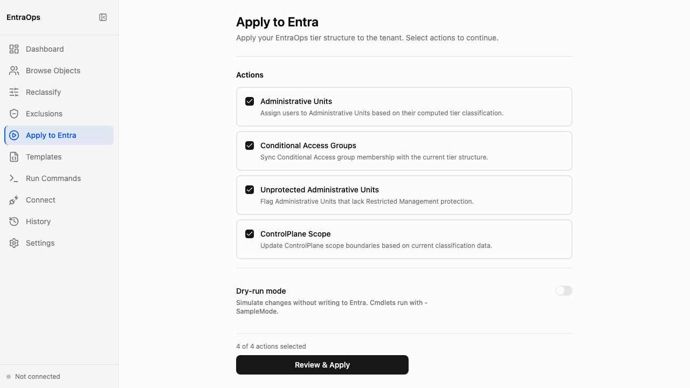

# Apply to Entra

**Navigation:** Sidebar → Apply to Entra  (or Object Browser / Reclassify → Apply to Entra button)

The Apply to Entra screen runs the EntraOps PowerShell implementation cmdlets directly from the browser. It guides you through four sequential workflow states — Select, Confirm, Streaming, and Outcomes — so you can review exactly what will happen before any changes are written to your tenant.

## Workflow States

### 1. Select — Choose actions to run

The initial view shows four implementation action toggles. Enable the actions you want to apply:

- **Update Administrative Units** — moves classified objects into their corresponding Administrative Units
- **Update Conditional Access Groups** — adds or removes objects from CA policy scope groups
- **Update Unprotected Administrative Units** — applies membership for AUs not yet under ControlPlane scope
- **Update ControlPlane Scope** — applies ControlPlane-tier role assignments and AU membership

Toggle **Dry-run / Preview mode** (amber indicator) to simulate the run with `-SampleMode` — no changes are written to Entra, and the run is excluded from Git history. Dry-run is recommended for first runs and after template changes.

Click **Run Implementation** to advance to Confirm.

### 2. Confirm — Review before committing

A confirmation screen lists the exact PowerShell cmdlets and parameters that will execute. Review the cmdlet names and parameter values (tenant ID, RBAC systems, scope). Click **Confirm & Run** to start the run, or **Back** to adjust selections.

### 3. Streaming — Real-time progress log

Once confirmed, the server starts the PowerShell implementation process and streams output line-by-line via Server-Sent Events. The log panel scrolls as output arrives. You can watch individual Steps, Skip notices, and any error lines in real time. The run cannot be cancelled once started.

### 4. Outcomes — Per-cmdlet pass/fail summary

When the run completes, the screen shows a summary table with one row per cmdlet: cmdlet name, status (Pass / Fail), and any error message. A run is considered successful when all enabled cmdlets show Pass. Use the **View History** link to see this run in the Git Change History screen.

## Key behaviours

- Implementation writes tenant changes via the allowlisted EntraOps PS cmdlets only — no arbitrary code execution
- Dry-run runs appear in the streaming log as normal but are excluded from the classification change history
- The screen is reachable from the sidebar, the Object Browser **Apply to Entra** button, and the Reclassify screen action bar
- Multiple simultaneous runs are not supported; the server enforces one active SSE stream at a time

