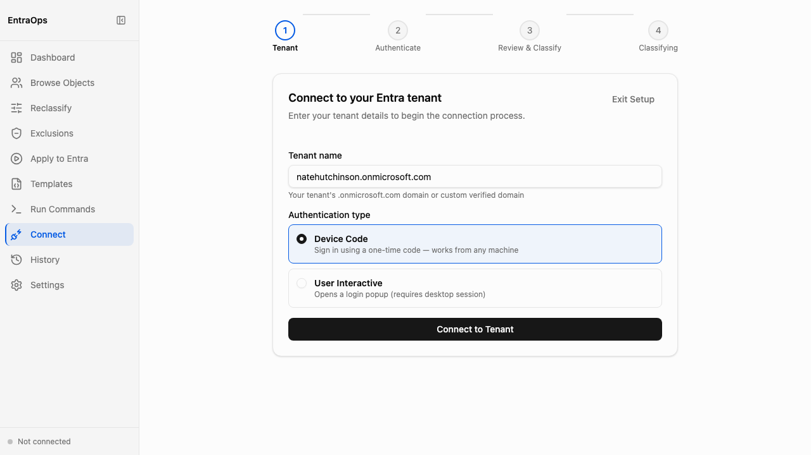

# Connect Wizard

**Navigation:** Sidebar → Connect

The Connect Wizard authenticates your Entra tenant connection and triggers the initial classification run. Use it when first configuring EntraOps or when switching to a different tenant. The wizard steps through tenant entry, authentication, classification review, and live classification output.

- Enter your tenant's `.onmicrosoft.com` domain or custom verified domain in the Tenant Name field
- Choose an authentication method: **Device Code** (sign in with a one-time code from any machine) or **User Interactive** (opens a login popup in a desktop session)
- A four-step progress indicator — Tenant → Authenticate → Review & Classify → Classifying — shows where you are in the connection flow
- After authentication, the Review & Classify step lets you confirm classification parameters before running
- The Classifying step streams cmdlet output in real time as EntraOps classifies tenant objects
- Connection status (tenant name and last classification timestamp) appears in the sidebar after a successful run
