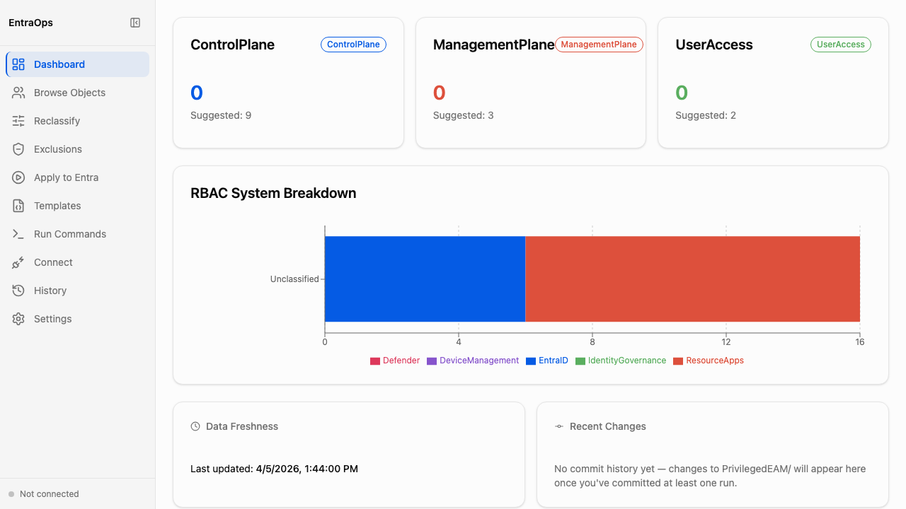

# Dashboard

**Navigation:** Sidebar → Dashboard

The Dashboard provides an at-a-glance overview of privileged access across all three EAM tiers — ControlPlane, ManagementPlane, and UserAccess. Open it after running a classification to verify tier coverage and identify objects that may need reclassification or exclusion.

- Tier summary cards display the current applied object count and a suggested count for each tier — a gap between the two indicates objects that match classification rules but have not yet had their tier applied
- RBAC System Breakdown chart shows distribution across EntraID, ResourceApps, Defender, DeviceManagement, and IdentityGovernance, grouped by classification status
- Data Freshness section shows the timestamp of the last classification run — use this to confirm the displayed data is current
- Recent Changes section shows a summary of tier assignment changes from the most recent classification run
- Data is read directly from `PrivilegedEAM/` JSON files — no live API calls at view time
