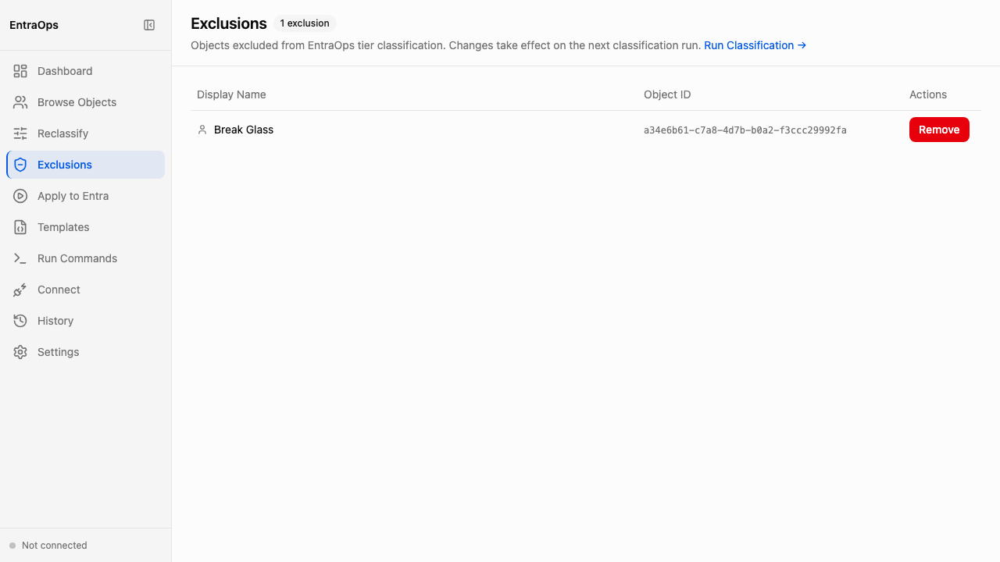

# Exclusions Management

**Navigation:** Sidebar → Exclusions

The Exclusions screen manages the list of Entra objects that are permanently excluded from tier classification. Excluded objects are skipped by the classification engine and will not appear with a tier badge in the Object Browser or affect tier counts in the Dashboard. Use it to exclude break-glass accounts, test identities, or service accounts that should never be classified.

- The exclusion count badge in the page header shows how many objects are currently excluded at a glance
- The table lists each excluded object's **Display Name** and **Object ID** (Entra GUID) — useful for auditing which accounts are excluded and why
- Click **Remove** on any row to remove that object from the exclusion list; changes take effect on the next classification run
- The **Run Classification** link in the subtitle navigates directly to the Run Commands screen to trigger a re-classification immediately after updating exclusions
- Excluded objects are stored in `Classification/Global.json` under the `ExcludedPrincipalId` array — objects excluded via the Object Browser also appear here
- Exclusions apply across all RBAC systems; there is no per-system exclusion scope
