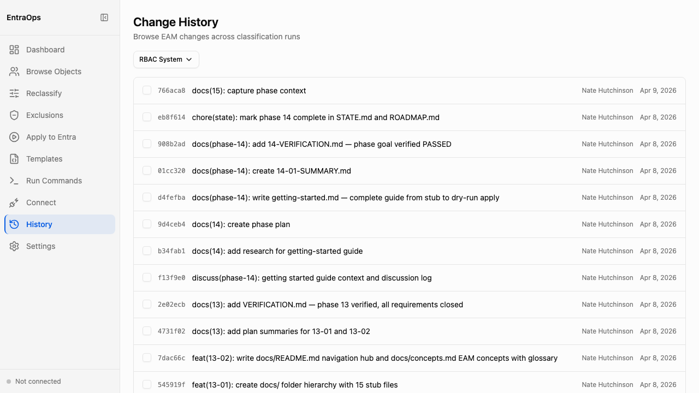

# Git Change History

**Navigation:** Sidebar → History

The History screen displays a git log of all commits that modified the `PrivilegedEAM/` classification output directory. Use it to audit when classification data changed, trace which run produced a specific tier assignment, and compare the commit history across RBAC systems.

- Each entry shows a short commit hash, commit message, author, and date — messages follow the EntraOps commit convention so they are machine-readable as well as human-readable
- The **RBAC System** dropdown filters the log to commits that touched a specific system's output (EntraID, ResourceApps, Defender, DeviceManagement, IdentityGovernance)
- Entries are ordered by most recent first; scroll down to view older runs
- Commit messages written by the classification engine include the cmdlet name and scope, making it straightforward to identify which run changed which objects
- Select one or more commits to compare changes between runs (compare view shows a diff of the JSON classification output)
