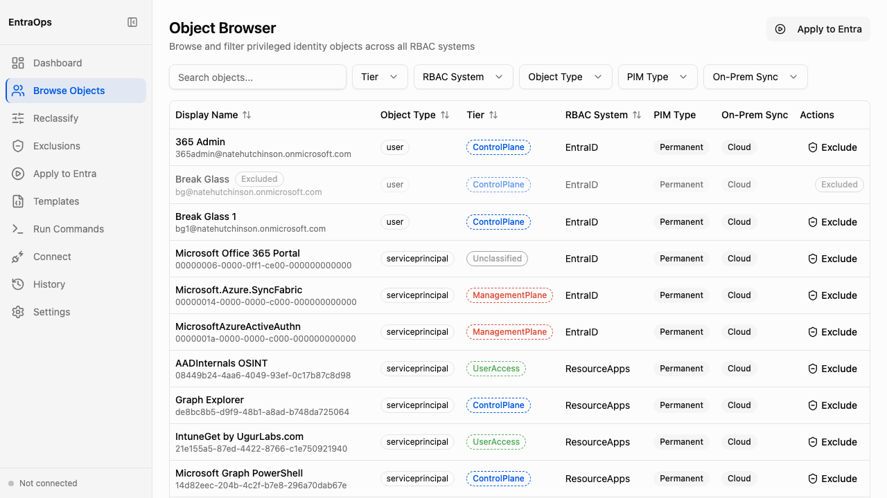

# Object Browser

**Navigation:** Sidebar → Browse Objects

The Object Browser is the primary view for reviewing privileged identity tier assignments across all connected RBAC systems. Use it to inspect which objects are classified at ControlPlane, ManagementPlane, or UserAccess, and to exclude individual objects from classification directly from the table.

- Full-text search filters the object table by display name or object ID in real time
- Filter dropdowns narrow the view by Tier, RBAC System (EntraID, ResourceApps, Defender, DeviceManagement, IdentityGovernance), Object Type (user, serviceprincipal), PIM Type, and On-Prem Sync status
- Each row shows the object's Display Name, Object Type, assigned Tier badge, RBAC System, PIM Type, and On-Prem Sync value
- Tier badges are colour-coded: ControlPlane (blue), ManagementPlane (red), UserAccess (green), Unclassified (grey)
- The **Exclude** action per row adds the object to the exclusions list — excluded objects show an "Excluded" badge and are skipped in the next classification run
- The **Apply to Entra** button in the top-right corner navigates to the Apply to Entra screen to push current tier assignments into Entra ID
