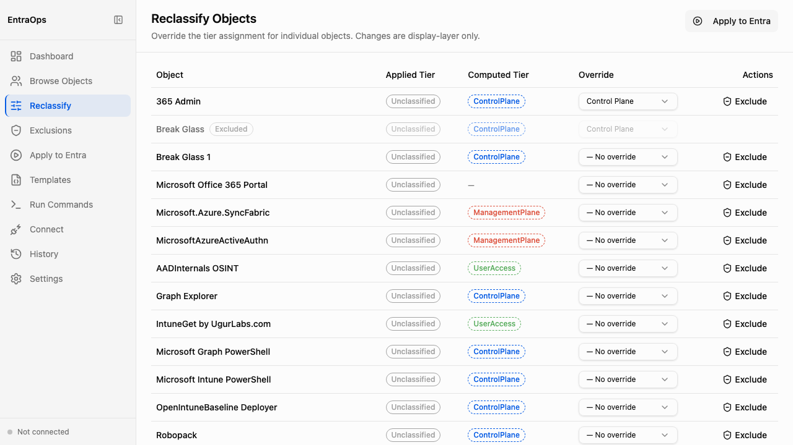

# Object Reclassification

**Navigation:** Sidebar → Reclassify

The Reclassify Objects screen lets you set per-object tier overrides that take precedence over the computed classification. Use it when a specific object requires a tier assignment that differs from what the classification templates would produce — for example, a service principal that should be treated as ControlPlane despite not matching any template rule.

- The **Applied Tier** column shows the tier currently written to the `PrivilegedEAM/` JSON files — "Unclassified" until a classification run has been applied
- The **Computed Tier** column shows the tier the classification engine derives from template rules — this is what would be applied on the next run without an override
- The **Override** dropdown per object lets you pin an object to a specific tier (ControlPlane, ManagementPlane, UserAccess) or clear a previous override with "— No override"
- Overrides are stored in `Classification/Overrides.json` and respected by all subsequent classification runs
- Changes are display-layer only until applied — use **Apply to Entra** to push updated tier assignments into Entra administrative units
- Excluded objects are shown with an "Excluded" badge and their Override dropdown is locked
