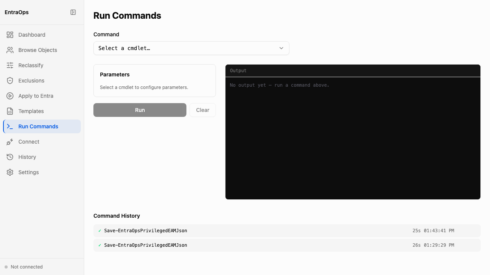

# PowerShell Command Runner

**Navigation:** Sidebar → Run Commands

The Run Commands screen executes EntraOps PowerShell cmdlets directly from the browser, streaming output in real time. Use it to re-run classification, save privileged EAM data, or trigger administrative unit updates without opening a terminal session.

- Select a cmdlet from the **Command** dropdown — only supported EntraOps cmdlets are listed, preventing arbitrary command execution
- Once a cmdlet is selected, the **Parameters** section surfaces the available parameters for that cmdlet; fill them in before running
- Click **Run** to execute the cmdlet; output streams line-by-line into the dark output panel on the right
- Click **Clear** to reset the output panel without interrupting a running command
- The **Command History** section at the bottom shows previous runs with cmdlet name, duration, and timestamp — useful for confirming when classification last ran and how long it took
- Classification output (JSON files written to `PrivilegedEAM/`) is available immediately after a successful run and reflected in the Dashboard and Object Browser
