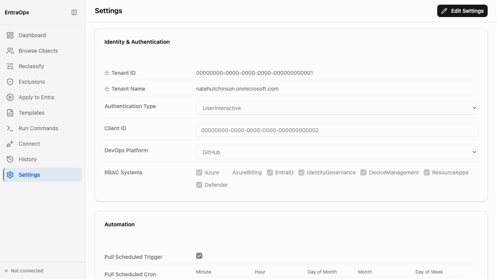

# Settings

**Navigation:** Sidebar → Settings

The Settings screen shows the current EntraOps configuration stored in `EntraOpsConfig.json`. Use it to review your tenant connection details, authentication method, DevOps platform, enabled RBAC systems, and automation schedule. Click **Edit Settings** to modify any value.

- **Identity & Authentication** section displays the Tenant ID, Tenant Name, Authentication Type (UserInteractive or DeviceCode), and Client ID used for Entra API calls
- **DevOps Platform** setting controls where EntraOps commits classification output — GitHub or Azure DevOps
- **RBAC Systems** checkboxes enable or disable classification for each system: Azure, AzureBilling, EntraID, IdentityGovernance, DeviceManagement, ResourceApps, and Defender
- **Automation** section configures the scheduled pull trigger — enable it and set a cron expression to run classification on a recurring schedule without manual intervention
- All settings map directly to fields in `EntraOpsConfig.json` — values edited here are written back to that file and take effect on the next classification run
- Click **Edit Settings** in the top-right corner to enter an inline edit mode; save or cancel without leaving the screen
