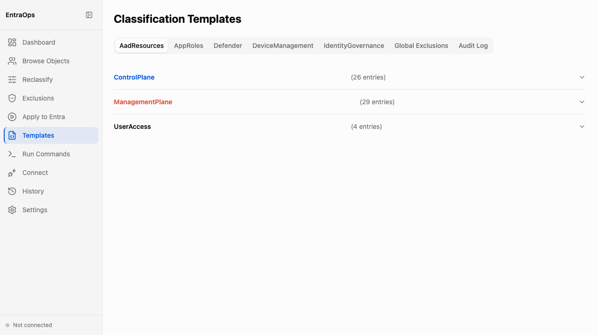

# Classification Template Editor

**Navigation:** Sidebar → Templates

The Template Editor provides a browser-based interface for browsing and understanding the EntraOps classification template rules stored in the `Classification/` directory. Use it to inspect which directory role definitions, app role assignments, or resource app permissions qualify objects for each tier, without opening a code editor or the file system.

- Template tabs across the top correspond to each classification template file: AadResources, AppRoles, Defender, DeviceManagement, IdentityGovernance, Global Exclusions, and Audit Log
- Within each tab, tier sections (ControlPlane, ManagementPlane, UserAccess) are collapsible and show the count of classification entries at a glance
- Expand a tier section to inspect individual classification rule entries — each entry defines which role, permission, or assignment pattern triggers that tier assignment
- Entry counts reflect the live state of the `Classification/` JSON files — reload the page after editing files on disk to see updated counts
- The Global Exclusions tab shows the contents of `Classification/Global.json` — the list of principal IDs excluded from all tier assignments
- The Audit Log tab surfaces a record of template file changes tracked by the classification engine
